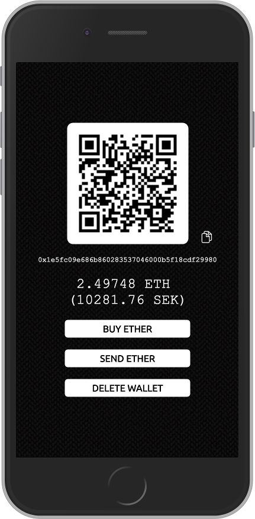

# Swish Wallet

PoC for an Ethereum web wallet that you can fund via Swedish payment app Swish.

Uses [Infura](https://www.infura.io) to connect to the __Ropsten__ test net.

Try it out here: https://monkybrain.github.io/swish-wallet/

### Features
* Generates private key/address stored in `localStorage`
* Private key encryption (AES-256)
* QR code for receiving ether
* QR scanner for sending ether
* Balance refreshed every 15 seconds and displayed in ETH and SEK
* Perform "mock funding" by clicking "buy ether", which opens the Swish app (if you have it installed) while simultaneously requesting 1 ETH from [MetaMask's Ropsten faucet](https://faucet.metamask.io).

### Build instructions

Install browserify

`npm install -g browserify`

Bundle all javascript files by running the following command in the root folder

`browserify js/*.js -o index.js`

