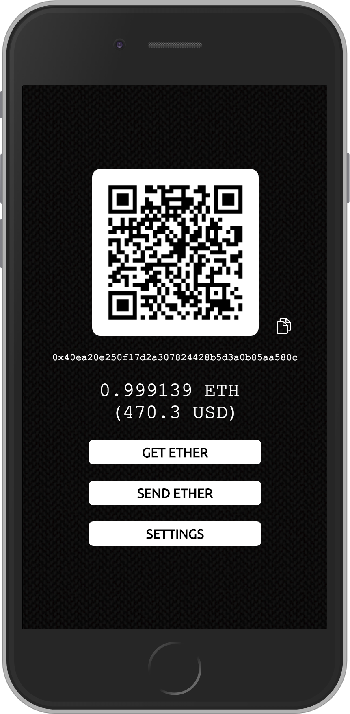

# Progressive Web Wallet

Ethereum wallet implemented as a Progressive Web App.

Uses [Infura](https://www.infura.io) to connect to the __Ropsten__ test net.

Try it out here: https://monkybrain.github.io/progressive-web-wallet/

Add it to your home screen for the complete PWA experience.

### Features
* Generates a private key and an address and stores them in `localStorage`
* Private key encryption (AES-256)
* QR code for receiving ether
* QR scanner for sending ether
* Balance refreshed every 15 seconds and displayed in ETH and the base currency of your choice
* Get ether by posting a request to [MetaMask's Ropsten faucet](https://faucet.metamask.io).

### Build instructions

Install browserify

`npm install -g browserify`

Bundle all javascript files by running the following command in the root folder

`browserify js/*.js -o index.js`

